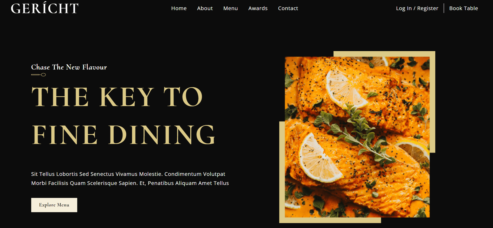

# Create React App

Geritch is a full responsive, Landing Page restaurant using "React"

<div align="center">
  <a href="https://main--geritch-restaurant-cm.netlify.app/" target="_blanck"></a>
  <h3 align="center">Geritch</h3>
</div>

## <br /> 📋 <a name="table">Summary</a>

- ✨ [Introduction](#introduction)
- 🛠 [Technology Used](#tech-stack)
- 🚀 [Launch App](#launch-app)
- 🎨 [Styling](#style)

## <br /> <a name="introduction">✨ Introduction</a>

Web design of the luxurious restaurant. Explore the handcrafted cocktails and the Chef Kevin Luo's culinary vision.

## <br /> <a name="tech-stack">🛠 Technology Used</a>

- [react-icon](https://www.npmjs.com/package/react-icons)
Include popular icons in your React projects easily with react-icons, which utilizes ES6 imports that allows you to include only the icons that your project is using.

## <br /> <a name="launch-app">🚀 Launch App</a>

<br/>**Cloning the Repository**

```bash
git clone {git remote URL}
```

<br/>**installation**

> After cloning the repository, run the command `npm install` to install the project's dependencies.

> Once the dependencies are installed, start the project with the command `npm run dev`.

## <br /> <a name="launch-app">🚀 Styling</a>

Global styling color defined using CSS in the src/index.css file.

```
:root {
  --font-base: 'Cormorant Upright', serif;
  --font-alt: 'Open Sans', sans-serif;
  
  --color-golden: #DCCA87;
  --color-black: #0C0C0C;
  --color-gray: #545454;
  --color-crimson: #F5EFDB;
  --color-grey: #AAAAAA;
  --color-white: #FFFFFF;
}
```
