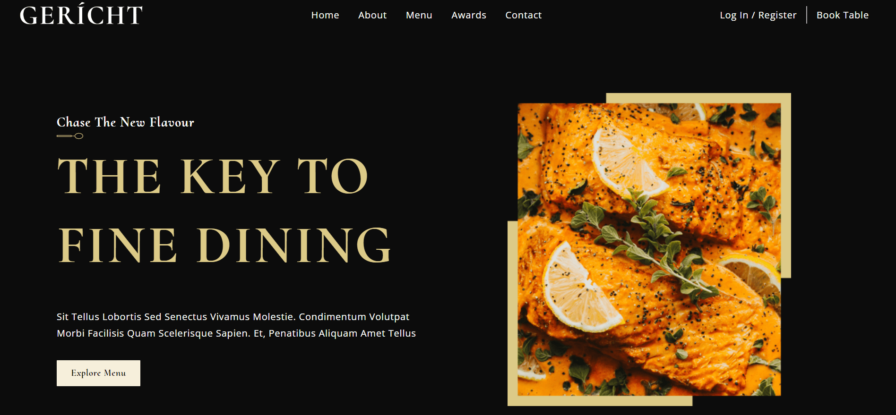

<div align="center">
  <a href="https://main--geritch-restaurant-cm.netlify.app/" target="_blanck"></a>
   <div align="center">
      
      
      
    </div>
  <h3 align="center"></h3>
</div>

## <br /> 📋 <a name="table">Summary</a>

- ✨ [Introduction](#introduction)
- 🛠 [Technology Used](#tech-stack)
- 🚀 [Launch App](#launch-app)
- 🎨 [Styling](#style)

## <br /> <a name="introduction">✨ Introduction</a>

**[ENG]** Geritch Restaurant is a fictional restaurant website built with React. The website is a single page application that showcases the restaurant's menu, services, and contact information. The website is fully responsive and mobile-friendly. The website is hosted on Netlify.

**[FR]** Geritch Restaurant est un site Web de restaurant fictif construit avec React. Le site Web est une application monopage qui présente le menu, les services et les coordonnées du restaurant. Le site Web est entièrement responsive et mobile-friendly. Le site Web est hébergé sur Netlify.

## <br /> <a name="tech-stack">🛠 Technology Used</a>

- [react-icon](https://www.npmjs.com/package/react-icons)
  Include popular icons in your React projects easily with react-icons, which utilizes ES6 imports that allows you to include only the icons that your project is using.

## <br /> <a name="launch-app">🚀 Launch App</a>

Follow these steps to set up the project locally on your machine.

**Prerequisites**

> [!NOTE]
> Make sure you have the following installed on your machine:

- [Git](https://git-scm.com/)
- [Node.js](https://nodejs.org/en)
- [npm](https://www.npmjs.com/) _(Node Package Manager)_

**Cloning the Repository**

```bash
git clone {git remote URL}
cd {git project..}
```

**Installation**

> After cloning the repository, run the command `npm i` or `yarn i` to install the project's dependencies.

> Run the development server:

```bash
npm run dev
# or
yarn dev
# or
pnpm dev
# or
bun dev
```
